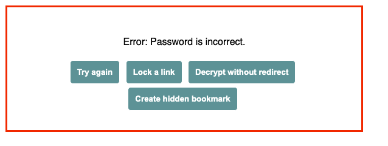

# Overview

If included sources and write ups from a few key classes from my Master's at Georgia Tech. The program quite intensive, with a number of classes requiring replication of academic papers as part of their.

## Courses

* [Computational Photography](computational_photography/README.md)
* [Reinforcement Learning](reinforcement_learning/README.md)

## Academic Honesty

For security and academic honesty (not sharing course solutions), my academic projects from Georgia Tech are stored separately on Google drive. The link is included below, but is only accessible via a password that has been sent to selected parties.

---

## Source Code Link

### <a target="_blank" rel="noopener" href="https://jstrieb.github.io/link-lock/#eyJ2IjoiMC4wLjEiLCJlIjoiZVZ2TFc0MjVDTkZjbFZTa1hUTzRYY1pqRWducDczWTFpdTJaYlF5ak1KSlk2UmZ4WExHak9kUjBFLzhCL2xrNnE2MkpIT3NBU3J1c09Tbk0xRm1VeFNiODUvWmdlN0Vkam1IUHpMTWZpYUg3Y2pjNEZ5MUZCQWJiYk9HUkRtL0JIME1tSEE9PSIsInMiOiJnaFoya1lBY3Z0Q3Y1V1l1M3ZRKzZnPT0iLCJpIjoicEVxY1kwSkJmWU95dWhWYSJ9">Password protected link to Georgia Tech projects folder</a>

---

 

## Troubleshooting

If you are presented with the error page below, click the **&lt;Try again&gt;** button and enter the link password.

